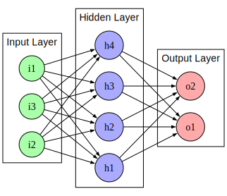

# Neural Network

* <https://datascience.stackexchange.com/questions/75855/what-types-of-matrix-multiplication-are-used-in-machine-learning-when-are-they>
* <https://stackoverflow.com/questions/10732027/fast-sigmoid-algorithm#10733861>
